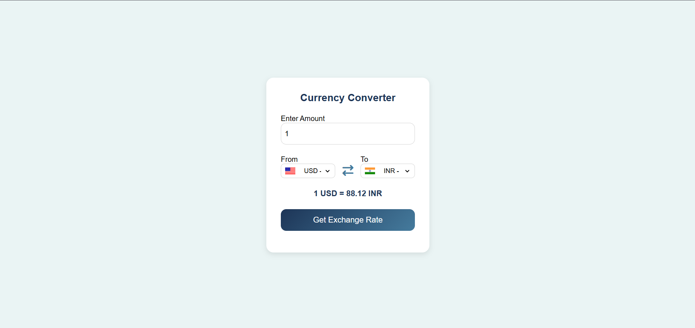

# forex-converter-app
# 💱 Currency Converter App

A simple and responsive **Currency Converter Web App** built with **HTML, CSS, and JavaScript**.  
It allows users to convert between different currencies in real-time using the [ExchangeRate API](https://exchangerate.host).

---

## 🚀 Features
- 🌍 Convert between 150+ world currencies  
- 🔄 Swap between "From" and "To" currencies  
- 🎨 Clean UI with a modern **finance-inspired theme**  
- 📱 Responsive design – works on desktop and mobile  

---

## 🛠️ Tech Stack
- **HTML5** – Structure  
- **CSS3** – Styling (Finance/Tech color palette)  
- **JavaScript (ES6)** – Logic & API integration  
- **ExchangeRate API** – Live currency exchange rates  

---

## 📸 Screenshot

---

## ⚡ How It Works
1. Enter an amount in the input field  
2. Select the "From" and "To" currencies  
3. Click **Get Exchange Rate**  
4. The app fetches the latest exchange rate via API and displays the result  

---

## 📌 Future Improvements
- Add support for **cryptocurrency conversion**  
- Show historical exchange rate charts  
- Dark mode toggle 🌙  

---

## 🤝 Contributing
Contributions, issues, and feature requests are welcome!  
Feel free to open a PR or raise an issue in the repo.  

---

## 📜 License
This project is licensed under the **MIT License** – free to use and modify.  

---

### 👨‍💻 Author
**Jeevan Kumar Janjanam**  
📧 janjanamjeevankumar@gmail.com  
🔗 [LinkedIn](https://www.linkedin.com/in/jeevan-kumar-b5a995252/) | [GitHub](https://github.com/jjk414)  

---
